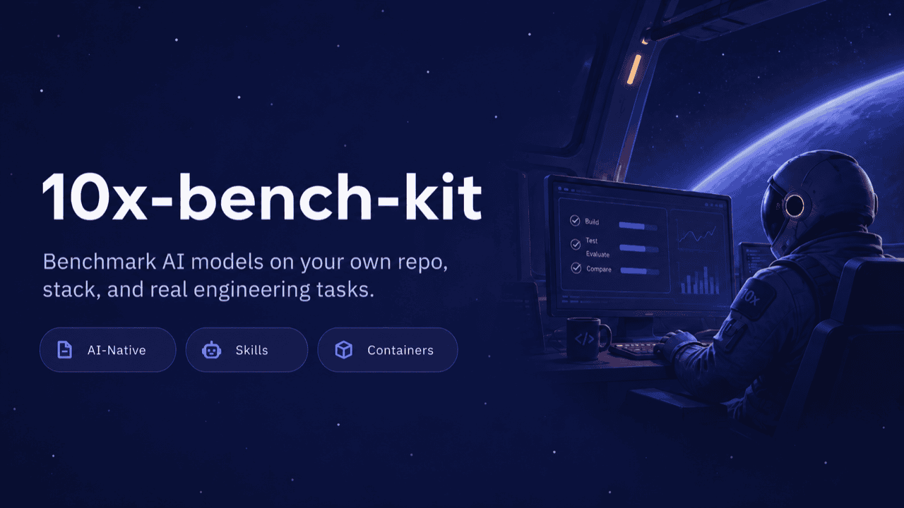

# 10x-bench-kit

Template repo for an internal AI agent benchmark. This repo is the basis
for a company's **benchmark instance**, created with [10xCLI](https://github.com/przeprogramowani/10x-cli)
(`10x bench-kit init`) — a separate repo that holds the tasks, the
evaluation pool, and the configuration, and runs agent trials against the
company's product repositories in full isolation.

Initial harness: **OpenCode** (exclusively). Measured: quality (automated
scoring + LLM-as-judge), cost, and execution time.

## Prerequisites

[10xCLI](https://github.com/przeprogramowani/10x-cli) — no global install
needed, run it directly with npx:

```bash
npx @przeprogramowani/10x-cli bench-kit init <directory>

# Or install globally for the shorter `10x` command
npm install -g @przeprogramowani/10x-cli
```

The examples below use the short `10x` form.

## Three zones

The repo structure is split into zones with different owners and different
behavior during `10x bench-kit update`:

| Zone | Owner | On `update` |
|---|---|---|
| `.bench-kit/` | kit (us) | replaced wholesale (atomic) |
| `.agents/skills/` | shared | proposed diff — the company decides |
| `tasks/`, `evaluation-pool/`, `bench.config.yaml` | company | untouchable |

Details of each zone's contract live in that zone's README.

## Quickstart (instance)

1. `10x bench-kit init <directory>` — materializes the template, runs a
   fresh `git init`, and records the version in the instance manifest.
2. Secrets wiring: API keys for the evaluated models, the judge model's
   key, and — for private base repos — `BASE_REPO_TOKEN`
   (fine-grained PAT, contents:read only).
3. Customization via skills (a conversation with an agent): an image
   matching the company's stack, populating `evaluation-pool/`,
   calibrating rubrics, first tasks.
4. `bench validate` — the gate before the first run.
5. Run: `workflow_dispatch` in GH Actions (`models`, `tasks`, `trials`).

## Trial lifecycle

One trial = one **model × task × trial** matrix job in a throwaway
container:

1. **Workspace** — a fresh copy of the base repo at the pinned commit +
   the task overlay; empty `XDG_DATA_HOME`; zero evaluation materials.
2. **Execution** — `opencode run` non-interactively with `prompt.md`,
   under a hard timeout.
3. **Metrics** — the adapter reads OpenCode storage → `metrics.json`;
   workspace diff → `patch.diff`.
4. **Evaluation** — with no agent present, assertions from the pool are
   mounted only now: static → tests → e2e → LLM-as-judge; the score is
   a weighted sum per `task.yaml`.
5. **Artifact** — `result.json` with version stamps (comparability era).

## Versioning and "eras"

Every result is stamped with the template version, the task directory
hash, the judge model, and the rubric version. Results are comparable
only within an era; releases marked `scoring-breaking` in
[CHANGELOG.md](CHANGELOG.md) close an era.

Full concept document: the benchmark DESIGN (internal repo).
